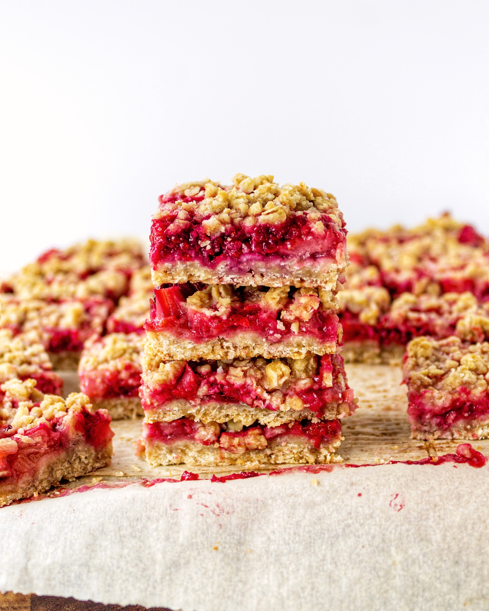

---

title: Berry Rhubarb Crumble Bars
description: Strawberry Raspberry Rhubarb Crumble Bars
date: '2019-05-30T12:00:00.121Z'
image: ./berry_rhubarb_bars.jpg
category: bars
tags: [bars, berry, fruity]

---

These bars are super easy to make and a great summer dessert! Feel free to use either fresh or frozen fruit. If you use fresh strawberries and/or berries, the texture will be a bit more chunky than frozen (seen in photos 3 and 4). From my experiments, frozen fruit will break down easier and form more of a jam like texture (seen in photos 1 and 2). The recipe says to use 450g of strawberries and 350g of rhubarb. If you don't have that much rhubarb (it's expensive yo!), replace some of the weight with raspberries, blueberries or more strawberries! Any combo will be delicious.

