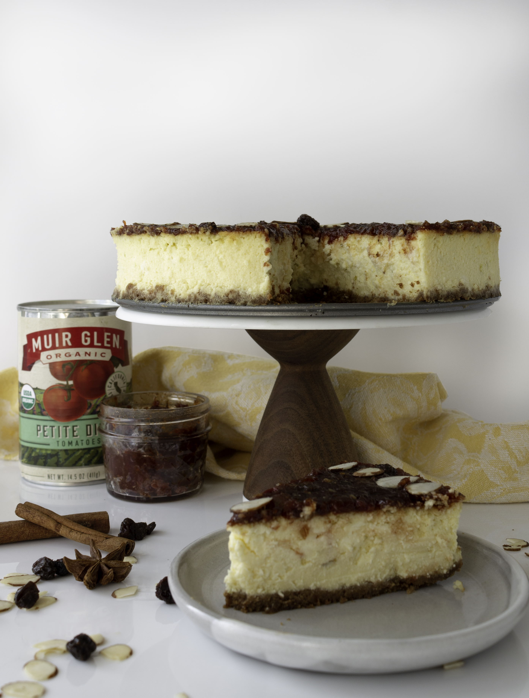
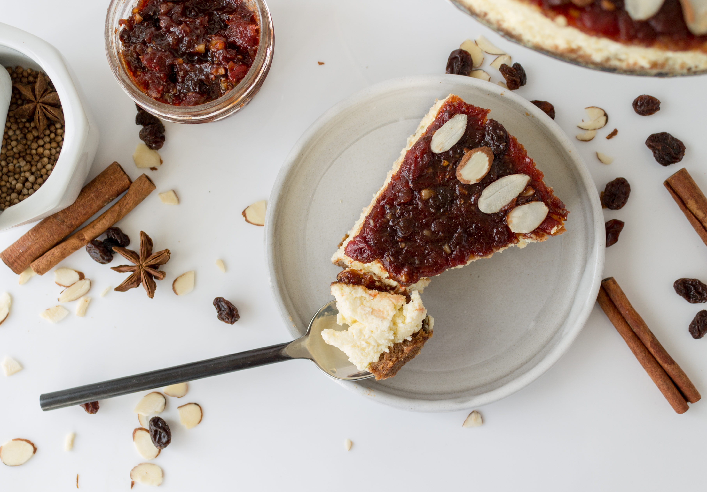

---
title: Mexican Ricotta Cheesecake with Tomato Mole Jam
description: Mexican Ricotta Cheesecake with Tomato Mole Jam
date: '2019-01-24'
image: ./mole_cheesecake-13.jpg
category: cake
tags: [cake, cheesecake, jam]
------

The first month of the New Year has already flown by and it’s bitter cold here in Brooklyn.  Even though winter is always fun (ie. skiing), I get that yearning to be on a beach in Mexico or basking in the Mediterranean sun whenever I am trudging to work through the snowy dirty streets of New York.  Making and eating this Mexican Ricotta Cheesecake with a Tomato Mole Jam is possibly the next best thing to hopping on a flight to warmer weather.  It has loads of spicy, complex flavors that will keep you warm and preoccupied until the sun comes out in a few months. 

When i was approached by Muir Glen and The Feedfeed to develop a recipe for them using their organic canned tomatoes, I wanted to think outside the box. Wanting to stay true to my *mostly* dessert feed, a tomato jam immediately came to mind. Tomato jams are usually made with onions, cumin and other savory spices. They show up on cheese plates, as condiments for sandwiches, on top of eggs and in vinaigrettes.  I wanted to make a more complex, sweeter jam that could do double duty as a perfect addition to a cheese plate but not feel weird on top of a dessert. Mole is a traditional sauce used in Mexican cuisines. According to Wikipedia - the source of all knowledge - a mole sauce contains a fruit, chili pepper, nut, and such spices as black pepper, cinnamon, cumin, and chocolate.  I could work with that. As you can see in the final recipe below, my mole jam has a lot of that - cinnamon, dried fruit, almonds and cocoa. The results? A sweet, (but not too sweet!) dynamic, interesting jam with a slightly spicy aftertaste.  It tastes like a tomato jam, but it also doesn’t really taste a whole lot like what you would think tomatoes taste like.  But what do I put it on? 

Enter the ricotta cheesecake. Using ricotta in place of some of the cream cheese makes the cake a lot lighter (in a calorie and fluffier way). This creates a good balance with the graham cracker crust and thick dense mole jam.  By using the tried and true water bath method (outlined in the instructions), my cheesecake came out perfect with no cracks, no overcooked edges and a flat top!  I also left it in the oven after I turned off the heat for a few hours, which I’ve read helps prevent cracking.

I ventured to my local co-op to buy the tomatoes, spices and other ingredients for this recipe.  Flatbush Food Coop is the closest one to me, but you can find your closest one here! The tomatoes are currently on sale for 10/$10 - which is very exciting because that’s almost half their regular price. Speaking of deals (which I’m a huge fan of), the entire co-op was extremely reasonably priced and they had an extensive bulk food and spice section where you can get just what you need (like for this recipe!). 

This cake is perfect when you want to try making something different.  The jam itself is a showstopper and I can imagine it works very well with all sorts of cheese, on top of your morning bagel and cream cheese, inside a pastry or mixed into yogurt.   The jam makes a little more than you actually need to cover the cake, so let me know if you make this recipe and what you did with the extra!

This post is sponsored by [Muir Glen](https://www.muirglen.com/) and [The Feedfeed](https://thefeedfeed.com/), but all opinions are my own.